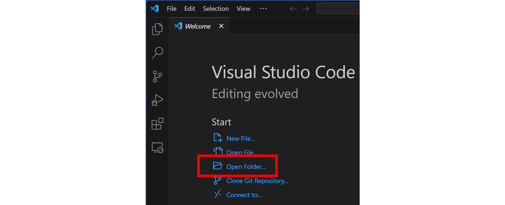
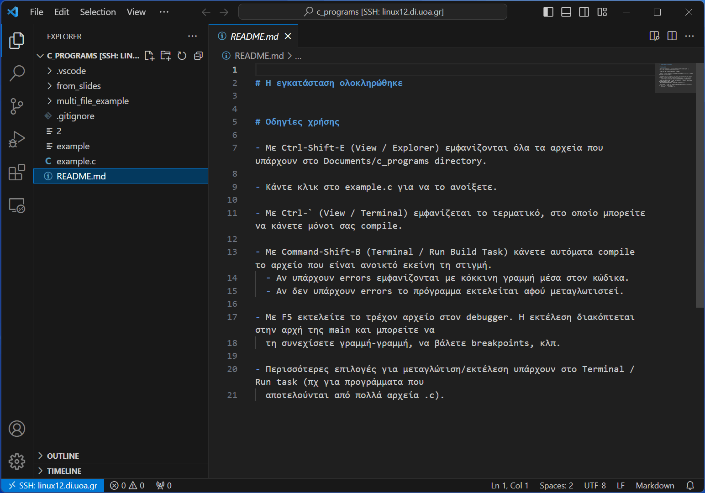
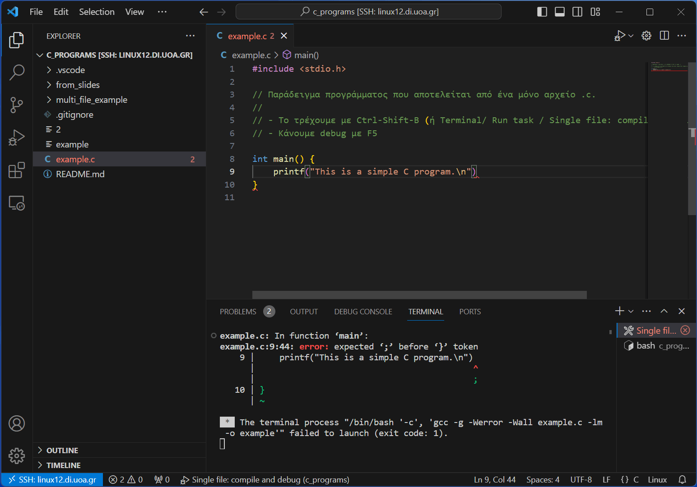
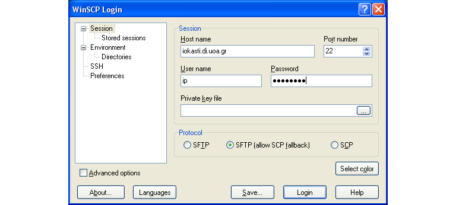
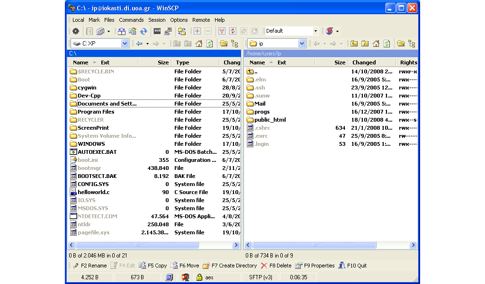
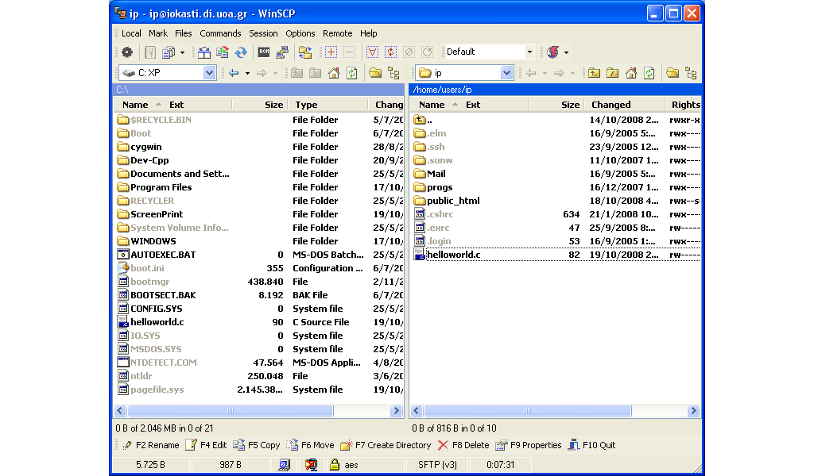
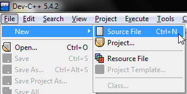
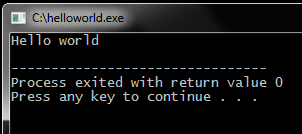

# Εργαστήριο #2: Editors

## Προγραμματιστικά Περιβάλλοντα (IDEs)

Στο εργαστήριο αυτό, θα ασχοληθούμε με δύο προγραμματιστικά περιβάλλοντα
για τη γλώσσα C: τον gcc μεταγλωττιστή της C σε περιβάλλον Linux, και
ένα ολοκληρωμένο περιβάλλον ανάπτυξης IDE, όπως το Visual Studio Code (vscode).
Επίσης, θα χρησιμοποιήσουμε και το πρόγραμμα scp/WinSCP για να μεταφέρουμε αρχεία
από υπολογιστές Windows στον λογαριασμό μας στην σχολή (και αντίστροφα). Τέλος,
θα χρησιμοποιήσουμε editors για να γράψουμε ένα πρόγραμμα που χειρίζεται δεδομένα
εισόδου σε γλώσσα C, θα το μεταγλωττίσουμε, θα το εκτελέσουμε
και θα πειραματιστούμε με την είσοδο και έξοδό του.

### 1. Το περιβάλλον προγραμματισμού Visual Studio Code

Στους λογαριασμούς των εργαστηρίων της σχολής είναι διαθέσιμο και το
Visual Studio Code, που επίσης αποτελεί ένα ολοκληρωμένο γραφικό
περιβάλλον ανάπτυξης κώδικα με διάφορες ευκολίες. Μπορούμε να το
εγκαταστήσουμε στον προσωπικό μας υπολογιστή, ακολουθώντας τις οδηγίες
που βρίσκονται εδώ:

<https://k08.chatzi.org/vscode/>

> Οι οδηγίες εγκατάστασης του vs code είναι υλικό που αναπτύχθηκε για το μάθημα Δομές δεδομένων (επόμενο εξάμηνο!) από τον καθ. Κωνσταντίνο Χατζηκοκολάκη τον οποίο και ευχαριστούμε ιδιαιτέρως!

Προτού χρησιμοποιήσουμε το vscode για πρώτη φορά με το λογαριασμό μας
στο εργαστήριο του τμήματος, θα πρέπει να έχουμε εκτελέσει την παρακάτω
εντολή στη γραμμή εντολής του λογαριασμού μας μέσω κάποιου ssh client (π.χ., native ssh ή PuTTY):

```sh
curl https://k08.chatzi.org/vscode/config.sh | bash
```

Γράφουμε code και εκτελούμε στην έναρξη ή επιλέγουμε το σχετικό
εικονίδιο από το μενού προγραμμάτων για να ανοίξουμε το περιβάλλον
προγραμματισμού Visual Studio Code.


Για να συνδεθούμε με το λογαριασμό μας στο εργαστήριο Linux του
Τμήματος, πατάμε το γαλάζιο εικονίδιο στην κάτω αριστερή γωνία του
παραθύρου:


Στις επιλογές που θα ανοίξουν στην κορυφή του παραθύρου επιλέγουμε
“Connect to Host…” (Remote SSH):


Στη συνέχεια πληκτρολογούμε το username μας ακολουθούμενο από @ και ένα
από τα μηχανήματα του εργαστηρίου και πατάμε enter:


Θα μας ζητήσει τον κωδικό του λογαριασμού μας στο εργαστήριο Linux και
ενδεχομένως, την πρώτη φορά που θα συνδεθούμε, αν εμπιστευόμαστε το
κλειδί του συγκεκριμένου μηχανήματος.


Αφότου βάλουμε τον κωδικό μας και πατήσουμε enter, θα πραγματοποιηθεί η
σύνδεση. Όσο είμαστε συνδεδεμένοι με το μηχάνημα του εργαστηρίου Linux,
αυτό θα εμφανίζεται στην κάτω αριστερή γωνία του παραθύρου στο γαλάζιο
πλαίσιο:


Από τις επιλογές του παραθύρου επιλέγουμε το `Open Folder...`. Σε
περίπτωση που δεν είναι ανοιχτό το Welcome screen, η επιλογή αυτή
υπάρχει και στο μενού File.



Πληκτρολογούμε η επιλέγουμε τον φάκελο `Documents/c_programs` που
βρίσκεται μέσα στον προσωπικό μας κατάλογο και πατάμε enter.


Ενδεχομένως να μας ζητηθεί αν εμπιστευόμαστε το περιεχόμενο που
βρίσκεται εκεί, πατάμε το `Yes, I trust the authors`.


Στο περιβάλλον που θα ανοίξει μπορούμε να περιηγηθούμε και να
δοκιμάσουμε τα προγράμματά μας. Υπάρχουν κάποιες βασικές οδηγίες στο
README.md που καλό είναι να τις διαβάσουμε, καθώς και μια πληθώρα
ενδεικτικών προγραμμάτων από τις σημειώσεις του μαθήματος.



Για να μεταγλωττίσουμε και να τρέξουμε το πρόγραμμα μας, Ctrl-Shift-B.
Αν το πρόγραμμα μας έχει συντακτικά λάθη ή επισημάνσεις, τότε στο κάτω
μέρος της οθόνης θα εμφανίζονται σχετικά μηνύματα του μεταγλωττιστή, τα
οποία περιγράφουν τη φύση του προβλήματος και μας καθοδηγούν για την
επίλυσή του. Αφού εκτελέσουμε το μεταγλωττιστή, τότε θα εμφανιστούν
μηνύματα όπως στην ακόλουθη εικόνα.



Αντίστοιχα, αν το πρόγραμμά μας είναι σωστό, στην περιοχή του τερματικού
θα εμφανιστούν τα αποτελέσματα της εκτέλεσής του.

## Η εφαρμογή scp / WinSCP για μεταφορά αρχείων

Ένας εύκολος τρόπος να μεταφέρουμε τα αρχεία μας από τον υπολογιστή μας σε
έναν απομακρυσμένο υπολογιστή (και τούμπαλιν) είναι η εντολή κονσόλας `scp`.
Η εντολή `scp` συμπεριφέρεται όπως η εντολή `cp` σε συστήματα Linux, απλά
αντί να αντιγράφει αρχεία τοπικά (μέσα στον ίδιο υπολογιστή) μπορεί να
αντιγράφει από και προς απομακρυσμένους υπολογιστές. Προκειμένου να αντιγράψετε
κάποιο αρχείο, ακουλουθούμε την σύνταξη:

```sh
scp local_file sdi2400999@linux08.di.uoa.gr:~/remote_file
```

όπου η εντολή παραπάνω αντιγράφει το τοπικό αρχείο με το όνομα `local_file` στο
απομακρυσμένο αρχείο `remote_file`. Αντιθέτως, για να αντιγράψουμε ένα
απομακρυσμένο αρχείο `remote.txt` σε ένα τοπικό `local.txt` ακολουθούμε την
σύνταξη:

```sh
scp sdi2400999@linux08.di.uoa.gr:~/remote.txt local.txt
```

Η εφαρμογή scp είναι αποκλειστικά για χρήση μέσω κονσόλας. Στην συνέχεια θα
χρησιμοποιήσουμε την εφαρμογή WinSCP που χρησιμοποιεί ένα Graphical User
Interface (GUI) για την μεταφορά αρχείων
από υπολογιστές Windows στους υπολογιστές των εργαστηρίων UNIX της σχολής.
Με τον τρόπο αυτό, μπορούμε να χρησιμοποιούμε τον υπολογιστή μας, ή τους
υπολογιστές του εργαστηρίου Windows για να γράφουμε τα προγράμματά μας,
να μεταφέρουμε τα αρχεία μας στο Unix και τελικά να ελέγχουμε την ορθή
λειτουργία τους με χρήση του μεταγλωττιστή gcc, που είναι και η επίσημη
πλατφόρμα εξέτασης του μαθήματος.

Για να εκτελέσουμε το WinSCP, κάνουμε στα εργαστήρια της σχολής
`Start->Run` και πληκτρολογούμε WinSCP.

Από το σπίτι μας, μπορούμε να κατεβάσουμε το πρόγραμμα από την
διεύθυνση:

<http://sourceforge.net/projects/winscp/files/latest/download>

Εκτελώντας το πρόγραμμα βλέπουμε την ακόλουθη οθόνη:



όπου πληκτρολογούμε τα στοιχεία σύνδεσης μας δηλαδή:

-   Τον υπολογιστή που θα συνδεθούμε
    (<http://cgi.di.uoa.gr/~ip/linux_lab_machines.html>)

-   Το όνομα χρήστη

-   Τον κωδικό μας

Και πατάμε το πλήκτρο `Login` οπότε και εμφανίζεται η ακόλουθη οθόνη:



Στο αριστερό μέρος της οθόνης φαίνονται τα περιεχόμενα του τοπικού
καταλόγου μας και στο δεξί μέρος της οθόνης φαίνονται τα περιεχόμενα του
λογαριασμού μας της σχολής.

Έτσι, για να μεταφέρουμε αρχεία από τον υπολογιστή μας, στον λογαριασμό
της σχολής, επιλέγουμε πρώτα τα αρχεία από το αριστερό μέρος της οθόνης
και έπειτα πατάμε το πλήκτρο Copy ή πατάμε το πλήκτρο για συντόμευση F5.
Εμφανίζεται τότε το ακόλουθο μήνυμα:


Με αυτό το μήνυμα ζητείται η επιβεβαίωση μας για την μεταφορά του
αρχείου από τον τοπικό κατάλογο στον χώρο του λογαριασμού μας της
σχολής. Αν πατήσουμε `Copy` το αρχείο μεταφέρεται στον λογαριασμό μας.

Βεβαίως είναι εφικτό να ακολουθήσουμε και την αντίστροφη διαδικασία, για
να αντιγράψουμε αρχεία από τον λογαριασμό μας στην σχολή, στον τοπικό
δίσκο.

Για να το κάνουμε αυτό επιλέγουμε το αρχείο που μας ενδιαφέρει από το
δεξί τμήμα της οθόνης και πατάμε το κουμπί `Copy`.



Και πατάμε `Copy` στο επιβεβαιωτικό παράθυρο που εμφανίζεται:


Το WinSCP μας παρέχει και άλλες πρόσθετες δυνατότητες που φαίνονται στο
κάτω μέρος της οθόνης:


όπως μετονομασία των αρχειων, δημιουργία καταλόγων, διαγραφή αρχείων και
καταλόγων κ.λ.π.

Όταν ολοκληρώσουμε τις εργασίες μας, πατάμε το κουμπι `Disconnect` για
να αποσυνδεθουμε.

## 3. Μεταγλώττιση προγραμμάτων σε Unix και VS Code

Κάνουμε login σε έναν από τους υπολογιστές του εργαστηρίου μας μέσω
VS Code όπου θα δημιουργήσουμε ένα καινούριο αρχείο με όνομα
`readint.c` και θα εισάγουμε τα ακόλουθα περιεχόμενα:

```c
/* File: readint.c */

#include <stdio.h>

int main() {
  int number;

  printf("Please give me a number: ");
  scanf("%d", &number);

  printf("I just read this number: %d\n", number);
  return 0;
}
```

Η συνάρτηση `scanf()` διαβάζει από την είσοδο δεδομένα προς επεξεργασία.
Συντάσσεται με αντίστοιχο τρόπο με την printf() δηλαδή:

```c
scanf("%y", &var);
```

όπου y είναι σύμβολο που αντιστοιχεί στον τύπο δεδομένων της μεταβλητής
var (π.χ, d για int, f για float, κλπ.). Παρατηρούμε ότι στο δεύτερο
όρισμα περνιέται η διεύθυνση της μεταβλητής var, για να αποθηκευθεί η
καταχώρηση και μετά το πέρας της κλήσης.

Μεταγλωττίστε και τρέξτε το παραπάνω πρόγραμμα. Πως συμπεριφέρεται;

Τι συμβαίνει αν αντί για αριθμό δώσετε μια λέξη ή μια κενή γραμμή;

Τι συμβαίνει αν αντί για αριθμό πληκτρολογήσουμε `Ctrl+D` (EOF);

Τι θα συμβεί αν αφαιρέσουμε την εντολή `fflush(stdout)`;

Τι θα συμβεί αν τυπώσουμε την μεταβλητή `number` πριν την διαβάζουμε;

Γιατί να μην δώσουμε μια σταθερά τιμή στην μεταβλητή `number` στο πρόγραμμά μας - γιατί να ζητήσουμε από τον χρήστη να δώσει μια τιμή;

Αν χρειαζόταν να διαβάσετε έναν αριθμό κινητής υποδιαστολής, πως θα το κάνατε;


## Άσκηση (ίσως μας βοηθήσει και στην Εργασία #0)

Γράψτε ένα πρόγραμμα C `calc.c` που δρα ως ένα κομπιουτεράκι (calculator) για
να πραγματοποιεί πρόσθεση. Το πρόγραμμά σας πρέπει να ζητά δύο ακεραίους
από την πρότυπη είσοδο (stdin) και στην συνέχεια να τυπώνει το άθροισμά
τους. Παράδειγμα εκτέλεσης ακολουθεί:

```sh
$ ./calc
Please enter the first number: 42
Please enter the second number: 58
The sum of the two numbers is: 100
$ echo $?
0
```

## Advanced #1: Calculator Υψηλής Ακρίβειας

Τροποποιήστε το παραπάνω πρόγραμμα προκειμένου να μπορεί να δέχεται μεγάλους
αριθμούς μέχρι και $10^{18}$. Το πρόγραμμά σας συνεχίζει να παράγει τα
αναμενόμενα αποτελέσματα;

## Advanced #2: Calculator με Διάφορες Πράξεις

Τροποποιήστε το calc πρόγραμμά σας προκειμένου να πραγματοποιεί πρόσθεση Ή
αφαίρεση ανάλογα με το τι προτιμάει ο χρήστης. Πως θα σχεδιάζατε την εφαρμογή
σας;

## Advanced #3: Calculator που χειρίζεται σφάλματα

Τροποποιήστε το calc πρόγραμμα προκειμένου να βγάζει κωδικό εξόδου 1 εάν
οτιδήποτε πάει στραβά κατά την εκτέλεση του προγράμματος - για παράδειγμα
εάν ο χρήστης δώσει το string "hello" αντί για αριθμό.


## ΠΑΡΑΡΤΗΜΑ: Αποσφαλμάτωση προγραμμάτων (Πράξη 1<sup>η</sup>)

Όταν καλούμαστε να δημιουργήσουμε ένα πρόγραμμα για τη λύση ενός
προβλήματος είναι σχεδόν απίθανο να είναι σωστό εξ αρχής. Οποιοσδήποτε,
όσο έμπειρος κι αν είναι, θα έχει στο πρόγραμμά του λάθη, τα ονομαζόμενα
bugs, τα οποία μπορεί να μην επιτρέπουν τη μεταγλώττιση του προγράμματος
ή/και να το κάνουν να μη δουλεύει με τον επιθυμητό τρόπο. Στο σημερινό
εργαστήριο θα εστιάσουμε στα συντακτικά λάθη, τα οποία αποτελούν μία
μορφή τέτοιων σφαλμάτων, και θα δούμε χρήσιμες τεχνικές για την εύρεση
και τη διόρθωσή τους.

### Συντακτικά λάθη

Ένα συντακτικό λάθος είναι, όπως υπαγορεύει και το όνομά του, ένα λάθος
στη σύνταξη του προγράμματός μας. Για να καταλάβει ο μεταγλωττιστής τα
προγράμματά μας πρέπει να είναι γραμμένα με έναν πολύ αυστηρό τρόπο.
Οποιαδήποτε παράλειψη σε αυτόν τον αυστηρό τρόπο σύνταξης θα έχει ως
αποτέλεσμα την αποτυχία της μεταγλώττισης.

Συχνά συντακτικά λάθη είναι η παράλειψη κάποιας παρένθεσης, το μη
κλείσιμο κάποιας αγκύλης, η χρήση μιας μεταβλητής που δεν έχουμε
δηλώσει, κλπ. Ας δούμε ένα παράδειγμα:

```c
#include <stdio.h>

main() {

  printf("Hello world!\n);

}
```

Αν δώσουμε τον παραπάνω κώδικα προς μεταγλώττιση θα πάρουμε το εξής
σφάλμα

```
4 missing terminating " character

5 syntax error before '}' token
```

Αυτό μας πληροφορεί ότι υπάρχει ένα σφάλμα στη γραμμή 4, το οποίο είναι
ότι λείπει ένας χαρακτήρας “, καθώς και ότι υπάρχει ένα συντακτικό λάθος
στη γραμμή 5 πριν το }.

Ας δούμε πρώτα το σφάλμα στη γραμμή 4. Με βάση αυτό, έχουμε παραλείψει
ένα χαρακτήρα “. Όντως, αν το κοιτάξουμε καλά, λείπει το κλείσιμο του “
στη συμβολοσειρά Hello world!\\n. Φτιάχνοντας αυτό, αυτόματα φεύγει και
το δεύτερο λάθος, το οποίο φανταστήκαμε ότι σχετίζεται με το πρώτο, αφού
πριν το } στη γραμμή 5 είναι η γραμμή 4, στην οποία ήδη έχουμε υπόψη μας
ένα σφάλμα.

Πειραματιστείτε με το παραπάνω πρόγραμμα για να δείτε τα διάφορα
συντακτικά λάθη που μπορεί να δημιουργηθούν. Αφαιρέστε το τελικό
ερωτηματικό στη συνάρτηση printf, αφαιρέστε το f απ' το printf, γράψτε
λάθος το όνομα της main, ξεχάστε το \# στο include και ό,τι άλλο
σκεφτείτε. Δείτε τα μηνύματα που σας δίνει ο μεταγλωττιστής και
προσπαθήστε να καταλάβετε πως σχετίζονται με αυτό που κάνατε. Ήταν όλα
τα μηνύματα που σας έβγαλε κατατοπιστικά;

### Τεχνικές εύρεσης και διόρθωσης συντακτικών λαθών

Όπως είδαμε και στο προηγούμενο παράδειγμα, τα συντακτικά λάθη είναι
εύκολο να τα ανακαλύψουμε αν διαβάσουμε τα μηνύματα του μεταγλωττιστή.
Αυτή είναι και η βασική τακτική που χρησιμοποιούμε για να τα εντοπίσουμε
και να τα διορθώσουμε. Κάθε μήνυμα του μεταγλωττιστή θα αναφέρει τη
γραμμή όπου υπάρχει το συντακτικό λάθος καθώς και μια περιγραφή του. Από
αυτά τα δύο στοιχεία μπορούμε, τις περισσότερες φορές, να βρούμε το
συντακτικό λάθος.

Ας δούμε όμως, το επόμενο παράδειγμα:

```c
#include <stdio.h>

main() {

printf("Hello world!\n");
```

Αν δώσουμε τον παραπάνω κώδικα προς μεταγλώττιση θα πάρουμε το εξής
σφάλμα

```
4 syntax error at end of input
```

Το οποίο μας λέει ότι υπάρχει ένα συντακτικό λάθος στη γραμμή 4 χωρίς
καμία επιπλέον υπόδειξη. Το λάθος είναι ότι δεν έχουμε κλείσει την
αγκύλη της main, οπότε ίσως να αναμέναμε κάτι σαν “syntax error, bracket
needed”.

Οπότε, είναι εμφανές ότι το να βασιζόμαστε μόνο στα μηνύματα του
μεταγλωττιστή για να διορθώσουμε τα συντακτικά λάθη δεν είναι μια
τακτική που αποδίδει πάντα. Αυτό που χρειάζεται είναι εμπειρία ώστε να
αποκτηθεί εξοικείωση με τα διάφορα συντακτικά λάθη, αλλά και προσοχή
κατά τη συγγραφή του κώδικα ώστε να αποφεύγουμε επιπολαιότητες.

## Παράρτημα Β'. Το περιβάλλον προγραμματισμού Dev-C++

Στους λογαριασμούς των Windows συστημάτων της σχολής είναι διαθέσιμο το
IDE Dev-C++, ένα γραφικό περιβάλλον ανάπτυξης κώδικα που απλοποιεί τη
διαδικασία συγγραφής και μεταγλώττισης κώδικα (“αποκρύπτοντάς” μας την
ύπαρξη και λειτουργία του gcc μεταγλωττιστή). Μπορούμε να το
εγκαταστήσουμε στον προσωπικό μας υπολογιστή, κατεβάζοντας την τελευταία
έκδοση από εδώ:

<http://sourceforge.net/projects/orwelldevcpp/files/latest/download>

Γράφουμε Dev-C++ και εκτελούμε στην έναρξη ή επιλέγουμε το σχετικό
εικονίδιο από το μενού προγραμμάτων για να ανοίξουμε το περιβάλλον
προγραμματισμού Dev-C++.


Για να δημιουργήσουμε ένα νέο αρχείο κώδικα, κάνουμε κλικ στο “File” -\>
“New” -\> “Source File”, ή στο εικονίδιο .



Στο κέντρο της οθόνης δημιουργείται ένα κενό αρχείο με όνομα καρτέλας
“Untitled1” στο οποίο μπορούμε να πληκτρολογήσουμε τον κώδικα του πρώτου
προγράμματός μας!

Ας γράψουμε εδώ λοιπόν, το πρώτο μας πρόγραμμα C:

```c
/* File: helloworld.c */

#include <stdio.h>

main()

{

  printf("Hello world\\n");

}
```

Αφού ολοκληρώσουμε την πληκτρολόγηση, πρέπει να αποθηκεύσουμε το αρχείο
κώδικα στον δίσκο μας (το αστέρι στα αριστερά της καρτέλας υποδηλώνει
πως έχουν γίνει αλλαγές που δεν έχουν σωθεί).


Για να το αποθηκεύσουμε, επιλέγουμε “File” -\> “Save” ή το κουμπί
,
ώστε να ανοίξει το σχετικό παράθυρο διαλόγου. Εκεί, πρώτα πηγαίνουμε στη
λίστα “Save as type” και επιλέγουμε “C source files (\*.c)”. Έπειτα,
πλοηγούμαστε στη τοποθεσία (π.χ. Επιφάνεια Εργασίας) όπου μας ενδιαφέρει
να αποθηκεύσουμε το αρχείο. Τέλος, δίνουμε ένα κατάλληλο όνομα στο
αρχείο (π.χ. helloworld.c) και αποθηκεύουμε.

Για να μεταγλωττίσουμε το πρόγραμμα μας, επιλέγουμε “Execute” -\>
“Compile” ή πατάμε το F9, ή πατάμε το εικονίδιο
. Αν το πρόγραμμα μας έχει
συντακτικά λάθη ή επισημάνσεις, τότε στο κάτω μέρος της οθόνης θα
εμφανίζονται σχετικά μηνύματα του μεταγλωττιστή, τα οποία περιγράφουν τη
φύση του προβλήματος και μας καθοδηγούν για την επίλυσή του. Αφού
εκτελέσουμε το μεταγλωττιστή, τότε θα εμφανιστούν μηνύματα όπως στην
ακόλουθη εικόνα.


Το πλαίσιο μας πληροφορεί για την ύπαρξη συντακτικού λάθους στην γραμμή
6, πριν το δεξί άγκιστρο. Όντως, πριν από αυτό το άγκιστρο έχουμε
ξεχάσει να πληκτρολογήσουμε το ερωτηματικό για να δηλώσουμε το τέλος της
εντολής. Υπάρχει περίπτωση, όπως με παλαιότερη έκδοση του λογισμικού, να
δούμε πιο γενικά μηνύματα λαθών, όπως απλά ‘Syntax error before “}”
token’.

Αμέσως λοιπόν μετά από μία επιτυχή μεταγλώττιση, για να εκτελέσουμε το
πρόγραμμά μας, επιλέγουμε “Execute” -\> “Run”. Τότε, ανοίγει ένα
παράθυρο του κελύφους εντολών των Windows (cmd.exe) στο οποίο
περιέχονται οι εκτυπώσεις εκτέλεσης του προγράμματός μας. Αφού το
πρόγραμμα ολοκληρώνεται με την εκτέλεση του μηνύματος, υπό κανονικές
συνθήκες το παράθυρο θα έκλεινε αυτόματα και άμεσα. Το Dev-C++ παρέχει
τη δυνατότητα εισαγωγής παύσης μετά το τερματισμό του προγράμματος,
μέχρι να πατηθεί οποιοδήποτε πλήκτρο.



Το Dev-C++ παρέχει πληθώρα διευκολύνσεων, όπως τη δημιουργία “project”
για τη διαχείριση πολλαπλών αρχείων πηγαίου κώδικα, οπτική αποσφαλμάτωση
του προγράμματός μας, προτάσεις αυτόματης συμπλήρωσης κλπ, τα οποία θα
δούμε σε επόμενα εργαστήρια.

