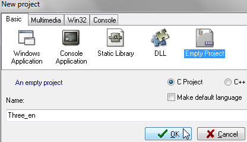
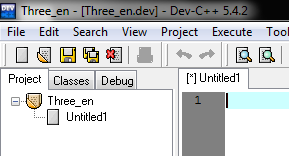
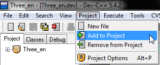
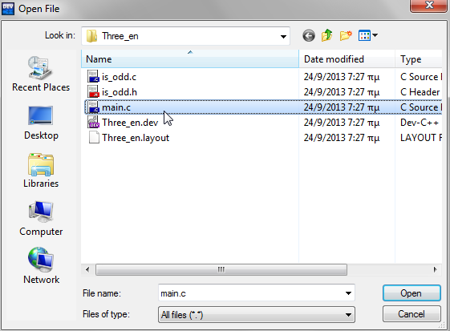

**ΕΡΓΑΣΤΗΡΙΟ 5:**

**Συναρτήσεις και Αναδρομή**

Στο εργαστήριο αυτό θα μάθουμε για τη χρήση συναρτήσεων με σκοπό την
κατασκευή αυτόνομων τμημάτων προγραμμάτων που υλοποιούν μία συγκεκριμένη
διαδικασία, τα οποία έχουν σαν στόχο τη δόμηση του προγράμματος σε
ανεξάρτητα μέρη και, επιπροσθέτως, αποτελούν δομικούς λίθους που μπορούν
να επαναχρησιμοποιηθούν και σε άλλα προγράμματα. Θα επεκτείνουμε τη
συζήτηση μιλώντας για αναδρομικές συναρτήσεις, δηλαδή για συναρτήσεις
που στο σώμα τους καλούν τον εαυτό τους. Επίσης, θα αναφερθούμε στις
εξωτερικές ή καθολικές (global) μεταβλητές και θα δούμε πότε μπορούν να
είναι χρήσιμες στον προγραμματισμό. Τέλος, σ' ένα παράρτημα, θα
περιγράψουμε τη διαδικασία δημιουργίας projects στο Dev-C++, που είναι
χρήσιμη όταν κάποιος θέλει να δουλεύει σ' αυτό το περιβάλλον και να έχει
οργανωμένο ένα πρόγραμμα C σε πολλά πηγαία αρχεία και αρχεία
επικεφαλίδας.

**Άσκηση 1:** Το πρόβλημα 3n+1

**1.1** Κατασκευάστε τη συνάρτηση int isodd(int n) που δέχεται σαν
όρισμα έναν ακέραιο και επιστρέφει 1, αν ο αριθμός είναι περιττός, ή 0,
αν ο αριθμός είναι άρτιος.

**1.2** Γράψτε σε γλώσσα C τον ακόλουθο (διατυπωμένο σε ψευδογλώσσα)
αλγόριθμο, που επιδεικνύει ένα άλυτο μέχρι στιγμής μαθηματικό πρόβλημα,
το λεγόμενο πρόβλημα του 3n+1.[^1]

Έστω τυχαίος ακέραιος n

Επανάλαβε όσο το n != 1

Αν ο n είναι περιττός θέσε n = 3n+1, αλλιώς θέσε n = n/2

Τύπωσε το n

+-------------+-------------+-----------------------------------------+
| Ορισμός     |             |                                         |
| Συνάρτησης  |             |                                         |
| (δείτε και  |             |                                         |
| σημειώσεις  |             |                                         |
| μαθήματος,  |             |                                         |
| σελ.        |             |                                         |
| 59-61):     |             |                                         |
|             |             |                                         |
| \<Tύπος     |             |                                         |
| Ε           |             |                                         |
| πιστροφής\> |             |                                         |
| \<Όνομα     |             |                                         |
| Συνάρτησης\ |             |                                         |
| >(\<Τυπικές |             |                                         |
| Πα          |             |                                         |
| ράμετροι\>) |             |                                         |
|             |             |                                         |
| {           |             |                                         |
|             |             |                                         |
| \<Εντολές   |             |                                         |
| και         |             |                                         |
| Δηλώσεις\>  |             |                                         |
|             |             |                                         |
| }           |             |                                         |
+-------------+-------------+-----------------------------------------+
| \<Τύπος     | \<Τυπικές   | Προαναγγελία πρωτότυπου συνάρτησης,     |
| Ε           | Π           | όταν καλείται πριν ορισθεί              |
| πιστροφής\> | αράμετροι\> |                                         |
|             |             | \<Tύπος Επιστροφής\> \<Όνομα            |
| Τύπος       | Μεταβλητές, | Συνάρτησης\>(\<Τυπικές Παράμετροι\>);   |
| δεδομένων   | μαζί με     |                                         |
| της τιμής   | τους τύπους | int main(void)                          |
| που         | τους, που   |                                         |
| ε           | χρησι       | {                                       |
| πιστρέφεται | μοποιούνται |                                         |
| από τη      | στη         | \....                                   |
| συνάρτηση   | συνάρτηση,  |                                         |
| μέσω της    | χωρισμένες  | }                                       |
| εντολής:    | με κόμμα,   |                                         |
|             | στις οποίες | \<Tύπος Επιστροφής\> \<Όνομα            |
| return      | δίνονται    | Συνάρτησης\>(\<Τυπικές Παράμετροι\>)    |
| \<π         | τιμές από   |                                         |
| αράσταση\>; | την καλούσα | {                                       |
|             | συνάρτηση.  |                                         |
| Σε          |             | \....                                   |
| περίπτωση   |             |                                         |
| μη          |             | }                                       |
| επιστροφής  |             |                                         |
| τιμής, ο    |             |                                         |
| \<Τύπος     |             |                                         |
| Ε           |             |                                         |
| πιστροφής\> |             |                                         |
| ορίζεται    |             |                                         |
| σαν void.   |             |                                         |
+-------------+-------------+-----------------------------------------+

**1.3** Δομήστε το πρόγραμμά σας σε ανεξάρτητα[^2] αρχεία. Για να
διαβάσετε τον ακέραιο n στη συνάρτηση main, χρησιμοποιήστε τη συνάρτηση
int getinteger(int base), που θα βρείτε στο πρόγραμμα
<http://www.di.uoa.gr/~ip/cprogs/convdecbin.c> (σελ. 71 σημειώσεων).

+-----------------------+-----------------------+-----------------------+
| main.c                | isodd.c               | isodd.h               |
|                       |                       |                       |
|                       | Κώδικας συνάρτησης    | Πρωτότυπο συνάρτησης  |
+-----------------------+-----------------------+-----------------------+
| #include \<stdio.h\>  | int isodd(int n)      | int isodd(int);       |
|                       |                       |                       |
| #include "isodd.h"    | {                     |                       |
|                       |                       |                       |
| #include              | \...\....             |                       |
| "getinteger.h"        |                       |                       |
|                       | }                     |                       |
| int main(void)        |                       |                       |
|                       |                       |                       |
| {                     |                       |                       |
|                       |                       |                       |
| \...\....             |                       |                       |
|                       |                       |                       |
| }                     |                       |                       |
+-----------------------+-----------------------+-----------------------+

+-----------------------+-----------------------------------------------+
| getinteger.c          | getinteger.h                                  |
|                       |                                               |
| Κώδικας συνάρτησης    | Πρωτότυπο συνάρτησης και ορισμός συμβολικής   |
|                       | σταθεράς                                      |
+-----------------------+-----------------------------------------------+
| #include \<stdio.h\>  | #define ERROR -1                              |
|                       |                                               |
| #include              | int getinteger(int);                          |
| \"getinteger.h\"      |                                               |
|                       |                                               |
| int getinteger(int    |                                               |
| base)                 |                                               |
|                       |                                               |
| {                     |                                               |
|                       |                                               |
| \...\....             |                                               |
|                       |                                               |
| }                     |                                               |
+-----------------------+-----------------------------------------------+

> **1.3.1** Μεταγλωττίστε το πηγαίο αρχείο isodd.c για να παραγάγετε το
> αντικειμενικό αρχείο isodd.o
>
> **1.3.2** Μεταγλωττίστε το πηγαίο αρχείο getinteger.c για να
> παραγάγετε το αντικειμενικό αρχείο getinteger.o
>
> **1.3.3** Μεταγλωττίστε το πηγαίο αρχείο main.c για να παραγάγετε το
> αντικειμενικό αρχείο main.o
>
> **1.3.4** Συνδέστε τα αντικειμενικά αρχεία main.o, isodd.o και
> getinteger.o για να παραγάγετε το εκτελέσιμο αρχείο myprog.

**Άσκηση 2:** Υπολογισμός όρων ακολουθίας Fibonacci.

**2.1:** Η ακολουθία Fibonacci ορίζεται από τη συνάρτηση:

Ορίστε την αναδρομική συνάρτηση int fib(int n) που να υλοποιεί τον
υπολογισμό του n-οστού όρου της ακολουθίας Fibonacci.

**2.2** Δημιουργήστε το πηγαίο αρχείο recfib.c το οποίο να υπολογίζει
τους όρους της ακολουθίας Fibonacci από n=28 μέχρι το n=35, καλώντας τη
συνάρτηση που υλοποιήσατε στο 2.1. Αμέσως μετά τον υπολογισμό, να
εμφανίζεται η τιμή του αντίστοιχου όρου της ακολουθίας Fibonacci στην
οθόνη.

**2.3** Μετρήστε τις αναδρομικές κλήσεις για κάθε εκτέλεση του παραπάνω
προγράμματος χρησιμοποιώντας μία καθολική (global) μεταβλητή. Εκτυπώστε
το πλήθος των αναδρομικών κλήσεων μετά από κάθε εκτέλεση.

**2.4** Παρατηρήστε το δένδρο αναδρομικών κλήσεων του προγράμματος για
n=4 για εξηγήστε την αύξηση του χρόνου υπολογισμού του προγράμματος σε
σχέση με τον όρο που υπολογίζεται.

**2.5** Ο n-οστός όρος της ακολουθίας Fibonacci μπορεί να υπολογισθεί
και επαναληπτικά, αν χρησιμοποιήσουμε δύο μεταβλητές για να αποθηκεύουμε
σε κάθε βήμα τους δύο προηγούμενους αριθμούς, ώστε προσθέτοντας τους, να
υπολογίζουμε τον επόμενο. Κατασκευάστε το πρόγραμμα fibonacci.c που να
υλοποιεί την παραπάνω επαναληπτική διαδικασία.

**ΠΑΡΑΡΤΗΜΑ:** Δημιουργία projects σε Dev-C++

Δημιουργούμε νέο project επιλέγοντας από το μενού File→New→Project, ή,
εναλλακτικά, πατώντας το εικονίδιο
{width="0.20555555555555555in"
height="0.1909722222222222in"}.

Στην οθόνη που εμφανίζεται, επιλέγουμε "Empty Project". Για να ορίσουμε
ότι θα γράψουμε σε γλώσσα C, τσεκάρουμε την επιλογή "C Project". Τέλος,
επιλέγουμε ένα όνομα για το project και πατάμε το ΟΚ.

{width="4.329166666666667in"
height="2.479861111111111in"}

Εμφανίζεται η οθόνη αποθήκευσης του project στον σκληρό δίσκο, οπότε
επιλέγουμε έναν κατάλογο και πατάμε το "Save".

{width="5.85in" height="4.302777777777778in"}

Για να προσθέσουμε νέα αρχεία κώδικα στο project μας, κάνουμε δεξί κλικ
στο όνομα του project στο αριστερό μέρος της οθόνης και επιλέγουμε "New
File".

{width="2.779166666666667in"
height="1.8909722222222223in"}

ή εναλλακτικά επιλέγουμε από το μενού "Project"→"New File" οπότε και
εμφανίζεται νέα, κενή καρτέλα.

{width="3.013888888888889in"
height="1.6298611111111112in"}

Αφού ολοκληρώσουμε, πατάμε Ctrl+S ή File→Save ή επιλέγουμε το εικονίδιο
{width="0.15in" height="0.15in"}. Εμφανίζεται η
οθόνη αποθήκευσης του αρχείου κώδικα στη οποία πληκτρολογούμε το όνομα
του αρχείου μαζί με την επέκτασή του (.c ή .h).

Την ίδια διαδικασία ακολουθούμε για να προσθέσουμε στο project και
οποιοδήποτε άλλο νέο αρχείο κώδικα (\*.c) ή αρχείο επικεφαλίδας (\*.h)
επιθυμούμε.

Επίσης, μας παρέχεται η δυνατότητα να προσθέσουμε ένα αρχείο κώδικα που
ήδη έχουμε δημιουργήσει και αποθηκεύσει στον υπολογιστή μας, επιλέγοντας
από το μενού "Project"→ "Add To Project, ή το σχετικό κουμπί από τη
μπάρα εικονιδίων.

{width="3.3965277777777776in"
height="1.382638888888889in"}

Εμφανίζεται η οθόνη επιλογής του αρχείου:

{width="5.85in" height="4.302777777777778in"}

στην οποία επιλέγουμε το αρχείο και το ενσωματώνουμε κάνοντας κλικ στο
Open.

Αφού ολοκληρώσουμε τη δημιουργία των αρχείων κώδικα ή την προσθήκη
αρχείων που ήδη έχουμε αποθηκευμένα στον υπολογιστή μας, πατάμε το
κουμπί {width="0.20555555555555555in"
height="0.20555555555555555in"} για να μεταγλωττίσουμε τα αρχεία κώδικα
(όλα μαζί) και τέλος το κουμπί
{width="0.16458333333333333in"
height="0.16458333333333333in"} για να εκτελέσουμε το πρόγραμμά μας.

Κατά την παραπάνω διαδικασία, αποθηκεύσαμε και ένα αρχείο με κατάληξη
.dev στον υπολογιστή μας. Το αρχείο αυτό περιέχει όλες τις πληροφορίες
ενσωμάτωσης πηγαίων αρχείων στο project μας και είναι αυτό που ανοίγουμε
από το μενού "File"→"Open" ώστε να συνεχίσουμε την εργασία μας σε ένα
project που έχουμε ήδη δημιουργήσει.

[^1]: Εικάζεται, αλλά δεν έχει αποδειχθεί μαθηματικά, ότι αν ξεκινήσουμε
    από ένα θετικό ακέραιο αριθμό n και πάρουμε σαν επόμενό του τον n/2,
    αν ο n είναι άρτιος, ή τον 3n+1, αν ο n είναι περιττός, συνεχίζοντας
    με αυτόν τον τρόπο, κάποια στιγμή θα καταλήξουμε στο 1. Για
    παράδειγμα, αν ξεκινήσουμε από το n=22, η ακολουθία αριθμών που θα
    πάρουμε με αυτή τη διαδικασία θα είναι η 22, 11, 34, 17, 52, 26, 13,
    40, 20, 10, 5, 16, 8, 4, 2, 1.

[^2]: Για τη δημιουργία σε Dev-C++ ενός project, με σκοπό τη διάσπαση
    ενός προγράμματος σε αρχεία σύμφωνα με τη δόμηση που εμφανίζεται
    παραπάνω, δείτε το παράρτημα.
